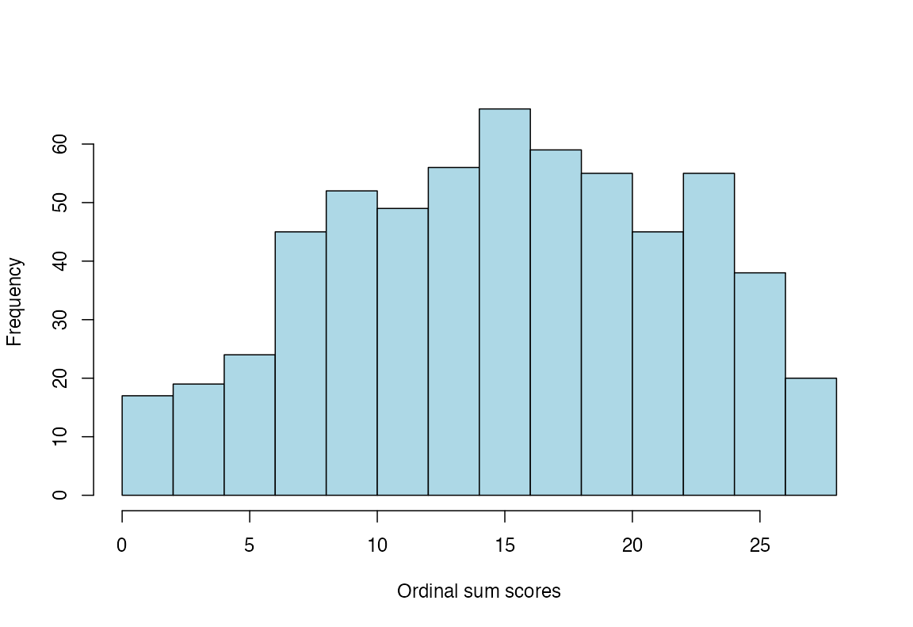
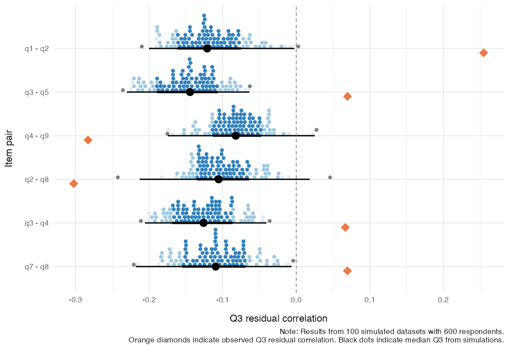
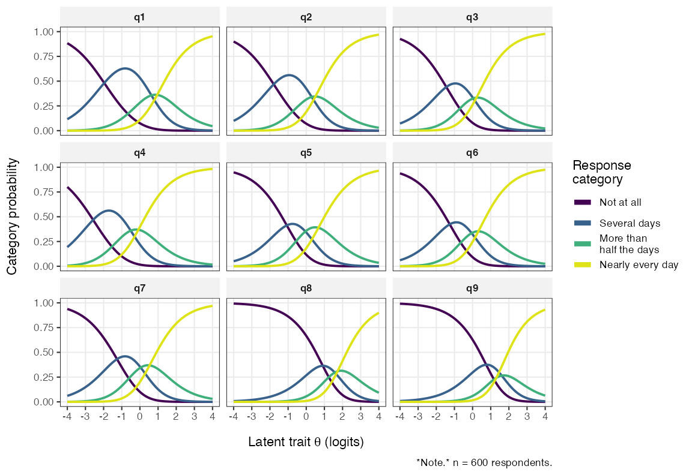
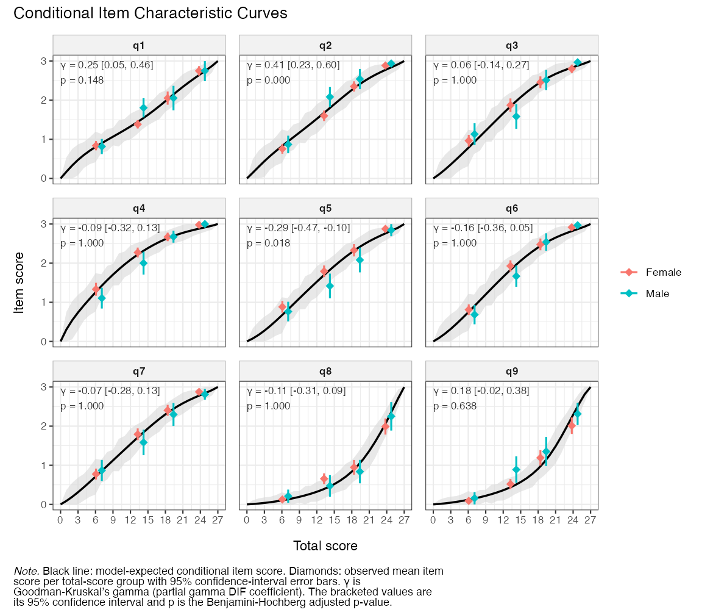
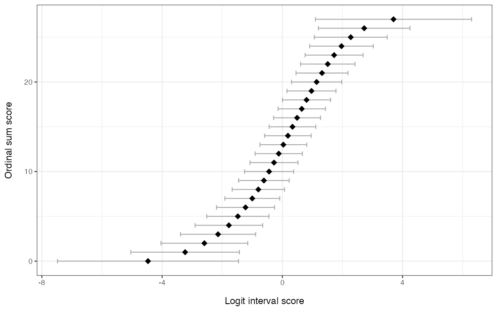
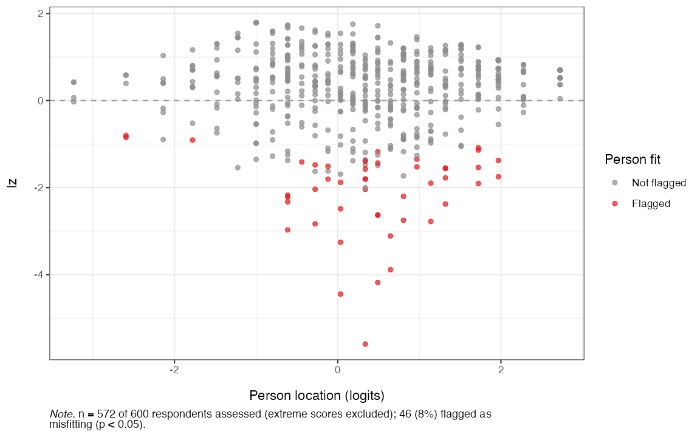

```{=html}
<style>
/* Journal-style figure captions: subtle left rule + muted colour */
.figure p.caption,
div.figure > p.caption,
figure > figcaption {
  font-size: 0.95em;
  padding-left: 0.75em;
  border-left: 3px solid #ccd;
  color: #555;
  margin-top: 0.5em;
  margin-bottom: 1.25em;
  line-height: 1.4;
}
</style>
```

## Overview

This vignette walks through the steps of a Rasch analysis using data from the
nine-item Patient Health Questionnaire (PHQ-9; @kroenke_phq9_2001). The example follows the four psychometric criteria proposed by @christensen_psychometric_2021 for the validation of patient-reported outcome measures (PROMs):

1. **Unidimensionality** --- the items measure a single latent
   construct.
2. **Local independence** --- after conditioning on the latent trait,
   item responses are independent of each other.
3. **Ordered response category thresholds** (monotonicity) --- moving
   up the latent trait increases the probability of higher categories.
4. **Invariance / no DIF** --- item parameters are the same across
   relevant external groups (e.g. gender).

We then move on to complementary descriptors that are commonly reported alongside the four criteria above:

- Targeting --- how well person and item locations overlap on the latent continuum.
- Reliability --- how precisely the scale separates respondents.
- Person fit --- unexpected response patterns.
- Item and person parameters --- estimates for reuse in scoring.

For a more extensive treatment of Rasch analysis in R, see
<https://pgmj.github.io/raschrvignette/RaschRvign.html>. For a Bayesian sibling package, see <https://pgmj.github.io/easyRaschBayes/>.

> **NOTE:** all simulation-based functions use a low number of iterations to make this vignette render faster. You should use more iterations for actual analysis work. For most methods, 500-1500 will be useful, except for conditional infit, where lower numbers can be optimal, depending on sample size [@johansson_detecting_2025]. If you plan to use `p_value = TRUE`, use at least 1000 iterations.

To get faster simulations, please make use of `options(mc.cores = 4)`, where `4` should be replaced with the number of high performance CPU cores your computer has available. This setting is automatically applied by all functions that can use parallel processing.

## Data

The bundled `phq9` dataset is a 600-respondent random subsample of the
PHQ-9 module from the U.S. National Health and Nutrition Examination
Survey (NHANES, September 2024 release) with complete responses on all
nine items. NHANES microdata are released to the public domain by the
U.S. federal government.


``` r
library(easyRasch2)
data(phq9)
items <- phq9[, 1:9]   # 9 item columns, scored 0..3

# add item information
item_desc <- c(
  "Little interest or pleasure in doing things",
  "Feeling down, depressed, or hopeless",
  "Trouble falling or staying asleep, or sleeping too much",
  "Feeling tired or having little energy",
  "Poor appetite or overeating",
  "Feeling bad about yourself - or that you are a failure or have let yourself or your family down",
  "Trouble concentrating on things, such as reading the newspaper or watching television",
  "Moving or speaking so slowly that other people could have noticed",
  "Thoughts that you would be better off dead or of hurting yourself in some way"
)

item_resp <- c("Not at all","Several days","More than \nhalf the days","Nearly every day")
```


``` r
str(items)
#> 'data.frame':	600 obs. of  9 variables:
#>  $ q1: int  3 0 1 2 3 3 1 3 2 1 ...
#>  $ q2: int  3 0 2 3 3 3 1 3 2 0 ...
#>  $ q3: int  3 1 3 0 3 1 0 3 2 0 ...
#>  $ q4: int  3 1 3 2 3 3 1 3 2 0 ...
#>  $ q5: int  3 0 3 2 3 2 0 1 2 0 ...
#>  $ q6: int  3 2 3 2 3 2 2 3 3 0 ...
#>  $ q7: int  3 3 3 2 3 2 2 3 3 0 ...
#>  $ q8: int  1 0 2 0 3 3 0 0 1 0 ...
#>  $ q9: int  3 0 0 2 3 1 2 0 0 0 ...
summary(rowSums(items))
#>    Min. 1st Qu.  Median    Mean 3rd Qu.    Max. 
#>    0.00   10.00   16.00   15.41   21.00   27.00
table(phq9$gender, useNA = "ifany")
#> 
#> Female   Male   <NA> 
#>    426    143     31
summary(phq9$age)
#>    Min. 1st Qu.  Median    Mean 3rd Qu.    Max. 
#>   15.00   26.00   33.00   36.06   44.00   85.00
```

### Descriptive plots

Before fitting any model it is worth eyeballing the response
distributions:


``` r
hist(rowSums(items), col = "lightblue", main = "", xlab = "Ordinal sum scores")
```

<div class="figure">

<p class="caption">**Figure 1.** *Histogram of ordinal sum scores*</p>
</div>


``` r
RMplotBar(items, ncol = 2)
```

<div class="figure">

<p class="caption">**Figure 2.** *Faceted bar chart of response distributions*</p>
</div>


``` r
RMplotStackedbar(items, show_percent = TRUE)
```

<div class="figure">

<p class="caption">**Figure 3.** *Stacked-bar response distribution*</p>
</div>


## 1. Unidimensionality

`easyRasch2` provides several complementary unidimensionality
diagnostics that can be combined for a robust conclusion:

- item-level conditional infit MSQ statistics [@muller_item_2020]
- item-level item-restscore associations with Goodman-Kruskal's $\gamma$ (gamma) [@kreiner_note_2011]
- confirmatory factor analysis (CFA) with WLSMV estimator for ordinal data
- principal components analysis (PCA) of the standardized residuals [@chou_checking_2010]
- Martin-Löf test with Monte-Carlo *p*-values [@christensenMonteCarloApproach2007]

### Conditional infit MSQ

It is important to note that the `RMitemInfit()` function uses **conditional**
infit, which is both robust to different sample sizes and makes ZSTD unnecessary
[@muller_item_2020]. Müller also questions the usefulness of outfit, and my
simulation study [@johansson_detecting_2025] reached the same conclusion. Thus,
outfit is not reported.

Conditional item infit mean-square statistics flag items whose response
patterns deviate from the Rasch expectation. With `RMitemInfitCutoff()`, per-item
highest-density intervals serve as the reference instead of rule-of-thumb cutoffs
[@johansson_detecting_2025]. Bootstrap *p*-values are also available via `p_value = TRUE`, with family-wise error rate (FWER; the default) or false discovery rate (FDR) correction.

> **NOTE:** All functions that use simulation-based cutoffs (except `RMitemInfitMI()`) have an optional `p_value = TRUE` for their table outputs.


``` r
infit_cut <- RMitemInfitCutoff(items, iterations = 100, parallel = FALSE,
                           seed = 3)
RMitemInfit(items, cutoff = infit_cut)
```


Table: MSQ values based on conditional estimation. n = 600 respondents. Cutoff values based on 100 simulation iterations (99.9% HDCI). Flagged: overfit = infit below range (more predictable); underfit = above range (noisier).

|Item | Infit MSQ| Infit low| Infit high|Flagged  | Relative location|
|:----|---------:|---------:|----------:|:--------|-----------------:|
|q1   |     0.946|     0.883|      1.143|         |             -0.56|
|q2   |     0.778|     0.883|      1.107|overfit  |             -0.76|
|q3   |     1.234|     0.878|      1.194|underfit |             -0.83|
|q4   |     0.835|     0.867|      1.178|overfit  |             -1.48|
|q5   |     1.069|     0.900|      1.110|         |             -0.58|
|q6   |     0.895|     0.858|      1.219|         |             -0.76|
|q7   |     0.986|     0.899|      1.153|         |             -0.66|
|q8   |     1.260|     0.856|      1.136|underfit |              0.97|
|q9   |     1.315|     0.842|      1.199|underfit |              0.79|


You can also get a plot summarizing simulated and observed item infit, using `RMitemInfitPlot()`. Since conditional infit needs complete data, sibling functions that combine multiple imputation with conditional infit are useful when you have partial missingness: `RMitemInfitMI()` and `RMitemInfitCutoffMI()`.

Based on the table, items 3, 8, and 9 underfit the Rasch model, while items 2 and 4 are overfit. Item 2 is "Feeling down, depressed, or hopeless", which is a very general item in terms of measuring depression, so this is expected.

A low item fit value, often referred to as an item being "overfit" to the Rasch model, indicates that responses may be too predictable. This is often the case for items that are very general/broad in scope in relation to the latent
variable. You will often find overfitting items to also have local dependence (residual correlations) issues with other items. Overfit may be likened to
having a much stronger factor loading than other items in a confirmatory factor
analysis or a higher level of discrimination in an Item Response Theory model
with two or more parameters.

A high item fit value, often referred to as being "underfit" to the Rasch model,
can indicate several things. Often underfit is due to multidimensionality or a question that is difficult to interpret and thus has noisy response data. The latter could for instance be caused by a question that asks about two things at the same time, or is ambiguous for other reasons.

### Item-restscore

Item-restscore uses Goodman-Kruskal's $\gamma$ (gamma) and shows the expected
and observed correlation between an item and a score based on the rest of the
items [@kreiner_note_2011]. Similarly, but inverted, to item infit, a lower
observed correlation value than expected indicates underfit, that the item may
not belong to the dimension. A higher than expected observed value indicates an
overfitting and possibly redundant item. Overfitting items will often also show
issues with local dependency.

Compared to infit, item-restscore more often flags overfit items (based on
experience), and less often flags underfit items (based on a simulation study
[@johansson_detecting_2025]).


``` r
RMitemRestscore(items)
```


Table: Item-restscore associations. n = 600 respondents. Flagged (adj. p < .05): overfit = observed above expected (over-discrimination, often local dependence); underfit = below (under-discrimination, often multidimensionality/noise).

|Item | Observed| Expected| Difference| Adj. p-value (BH)|Flagged  | Rel. location|
|:----|--------:|--------:|----------:|-----------------:|:--------|-------------:|
|q1   |     0.66|     0.62|       0.04|             0.210|         |         -0.56|
|q2   |     0.72|     0.62|       0.10|             0.000|overfit  |         -0.76|
|q3   |     0.57|     0.63|      -0.06|             0.085|         |         -0.83|
|q4   |     0.71|     0.62|       0.09|             0.000|overfit  |         -1.48|
|q5   |     0.62|     0.62|       0.00|             0.968|         |         -0.58|
|q6   |     0.69|     0.63|       0.06|             0.021|overfit  |         -0.76|
|q7   |     0.64|     0.62|       0.02|             0.476|         |         -0.66|
|q8   |     0.55|     0.63|      -0.08|             0.021|underfit |          0.97|
|q9   |     0.59|     0.64|      -0.05|             0.151|         |          0.79|


Similarly to infit, item-restscore found items 2 and 4 to be overfit and 8 to be underfit. It also found item 6 to be overfit. These methods are best used together.

### CFA-based cutoffs for CFI / RMSEA and item loadings

`RMdimCFACutoff()` simulates data from a unidimensional PCM and fits a
unidimensional ordinal CFA to each simulated dataset, building a
parametric-bootstrap reference distribution for the model fit indices (SRMR,
CFI, RMSEA) *and* for the per-item standardized factor loadings. It returns
this simulation object; `RMdimCFA()` then fits the CFA to the observed data and
tabulates the observed fit indices and loadings against the simulated reference.
Observed values beyond the simulated cutoffs are implausible under a unidimensional data-generating process.


``` r
cfa_cut <- RMdimCFACutoff(items, iterations = 100, parallel = FALSE,
                       seed = 2)
cfa_tbl <- RMdimCFA(items, cutoff = cfa_cut)
cfa_tbl$fit
```


Table: Partial Credit Model posterior-predictive CFA fit-index check. Observed CFA fit (one-factor, lavaan WLSMV, ordered = TRUE) vs simulated null under PCM unidimensionality (100 iterations at n = 600 simulees). n = 600 respondents. Cutoffs one-sided at the 99th percentile; flagged when the observed value lies in the worst 1% of the null in the unfavourable direction.

|Index | Observed| Cutoff|Direction  |Flagged |
|:-----|--------:|------:|:----------|:-------|
|CFI   |   0.9623| 0.9957|< 1st pct  |TRUE    |
|RMSEA |   0.1217| 0.0351|> 99th pct |TRUE    |
|SRMR  |   0.0572| 0.0257|> 99th pct |TRUE    |


``` r
cfa_tbl$loadings
```


Table: Standardized factor loadings (one-factor, lavaan WLSMV) vs the simulated expected range under PCM unidimensionality (100 iterations at n = 600 simulees). n = 600 respondents. Expected range is the two-sided central 99% interval of the simulated loadings; Flagged = below / above that range.

|Item | Observed| Expected low| Expected high|Flagged |
|:----|--------:|------------:|-------------:|:-------|
|q1   |    0.790|        0.682|         0.786|above   |
|q2   |    0.876|        0.689|         0.809|above   |
|q3   |    0.693|        0.707|         0.814|below   |
|q4   |    0.823|        0.664|         0.824|        |
|q5   |    0.737|        0.699|         0.812|        |
|q6   |    0.797|        0.702|         0.821|        |
|q7   |    0.753|        0.704|         0.805|        |
|q8   |    0.670|        0.692|         0.816|below   |
|q9   |    0.718|        0.709|         0.816|        |


`RMdimCFAPlot(cfa_cut, data = items)` returns a list of two figures: `$loadings`
(observed loadings against their simulated expected ranges) and `$fit` (the
simulated fit-index distributions with the observed values overlaid).

The table above agrees mostly with earlier findings. The overall model fit is clearly worse than expected under unidimensionality and item 2 is overfit (higher standardized factor loading than expected), with items 3 and 8 underfit (lower loadings). Additionally, the CFA flags item 1 as overfit. We should however take the simulation-based results with a grain of salt since we are using too few iterations to get reliable results.

### Residual PCA

After fitting the Rasch model, the residuals should contain no further
systematic structure. The *largest eigenvalue* of the residual correlation
matrix can be considered the headline diagnostic; a value clearly above the
simulation-based cutoff suggests a secondary dimension. However, an eigenvalue below the cutoff does not by itself support unidimensionality.


``` r
pca_cut <- RMdimResidualPCACutoff(items, iterations = 100, parallel = FALSE,
                       seed = 1)
RMdimResidualPCA(items, cutoff = pca_cut)
```


Table: Partial Credit Model (9 items), n = 600 respondents. Total observed variance: 51.3% explained by measures, 48.7% unexplained. First-contrast cutoff = 1.217 based on 100 simulation iterations (99th percentile).

|Component | Eigenvalue| Proportion of variance|Flagged |
|:---------|----------:|----------------------:|:-------|
|PC1       |      1.520|                  0.200|TRUE    |
|PC2       |      1.341|                  0.176|TRUE    |
|PC3       |      1.113|                  0.146|FALSE   |
|PC4       |      0.909|                  0.119|FALSE   |
|PC5       |      0.853|                  0.112|FALSE   |


Also of interest is the plot of item standardized loadings on the first residual
contrast and item locations. This figure can be helpful to identify clusters
in data, perhaps related to local dependency and/or multidimensionality.


``` r
RMdimResidualPCA(items, output = "ggplot")
```

<div class="figure">

<p class="caption">**Figure 4.** *Standardized loadings on the first residual contrast*</p>
</div>

### Martin-Löf test

This is a likelihood-ratio test of unidimensionality against an a priori specified multidimensional alternative. The *p*-value is obtained by parametric-bootstrap (Monte Carlo) sampling under the unidimensional null. A significant *p*-value constitutes strong evidence that items do not all measure one common latent variable. However, while a non-significant *p*-value indicates that data are consistent with one common latent variable across the partition, it is not to be considered proof of unidimensionality on its own.

In the use case demonstrated below, we have hypothesized that the five psychosomatic symptoms are a separate subscale from the other items. Looking at the PCA plot above, we can see tendencies of this clustering based on the loadings on the first residual contrast factor, with items 3-5 most clearly deviating from 1, 2, 6, and 9. Using the PCA plot to determine item partitioning for the M-L test is not recommended; see `?RMdimMartinLof` for details and references.


``` r
mlof <- RMdimMartinLof(items, iterations = 100,
                       partition = list(
                         c("q1","q2","q6","q9"),
                         c("q3","q4","q5","q7","q8")
                       )
)

mlof$p_value
#> [1] 0.00990099
mlof$wle_correlation
#>   subscale_a subscale_b     r ci_lower ci_upper   p_value   n
#> 1          1          2 0.717    0.676    0.754 5.994e-96 600
```

The *p*-value rejects unidimensionality across the partition, while the subscale WLE correlation indicates the dimensions are strongly related. The M-L test results can be further investigated using the diagnostic function `RMdimMartinLofResiduals()`.

## 2. Local independence

Local independence (LD) can be assessed with multiple methods. Yen's $Q_3$
statistic [@yen_scaling_1984] is the correlation between
person-item standardized residuals for every item pair. Pair-wise
$Q_3$ values above the simulation-based cutoff flag LD [@christensen2017].


``` r
q3_cut <- RMlocdepQ3Cutoff(items, iterations = 100, parallel = FALSE,
                           seed = 4)
q3_results <- RMlocdepQ3(items, cutoff = q3_cut)
q3_results$matrix
```


Table: Dynamic cut-off: 0.031 (mean Q3 -0.109 + 0.14). Global simulation cutoff (99th pctl of max-mean Q3) from 100 iterations. Correlations exceeding the cut-off may indicate local dependence; see the per-pair table for detail. n = 600 respondents.

|   |q1    |q2    |q3    |q4    |q5    |q6    |q7    |q8    |q9 |above_cutoff |
|:--|:-----|:-----|:-----|:-----|:-----|:-----|:-----|:-----|:--|:------------|
|q1 |      |      |      |      |      |      |      |      |   |             |
|q2 |0.23  |      |      |      |      |      |      |      |   |*            |
|q3 |-0.19 |-0.19 |      |      |      |      |      |      |   |             |
|q4 |0     |-0.03 |0.08  |      |      |      |      |      |   |*            |
|q5 |-0.2  |-0.25 |0.09  |0     |      |      |      |      |   |*            |
|q6 |-0.18 |0.02  |-0.15 |-0.14 |-0.12 |      |      |      |   |             |
|q7 |-0.13 |-0.18 |-0.2  |-0.08 |-0.13 |-0.05 |      |      |   |             |
|q8 |-0.17 |-0.3  |-0.18 |-0.16 |-0.1  |-0.18 |0.08  |      |   |*            |
|q9 |-0.12 |0.06  |-0.23 |-0.31 |-0.24 |0.02  |-0.19 |-0.11 |   |*            |


For a more powerful $Q_3$ test, one can use the simulated cutoffs object to plot the expected range of residual correlations for each item-pair and compare with the observed value. We'll limit the output to the 6 item-pairs that deviate the most.


``` r
q3_plots <- RMlocdepQ3Plot(simfit = q3_cut, data = items, n_pairs = 6)
q3_plots$pairs
```

<div class="figure">

<p class="caption">**Figure 5.** *Observed and expected $Q_3$ residuals*</p>
</div>

Here we can see that the overfit item 2 does indeed have the strongest LD issues, primarily with item 1, but also with item 9. For analysis of multidimensionality, it can also be interesting to see which items have lower than expected residual correlations.

### Partial gamma LD

A second perspective on LD is the *partial gamma* coefficient
[@kreinerAnalysisLocalDependence2004;@kreiner_validity_2007] between observed
item pairs, conditional on the rest-score. Note that this function evaluates both directions of LD, thus the output is two tables. We'll restrict the output to the 6 item-pairs with largest LD deviations.


``` r
RMlocdepGamma(items, n_pairs = 6)
```

Table: Partial gamma LD analysis. n = 600 respondents. Positive gamma indicates positive local dependence between items. Showing top 6 of 36 pairs by |gamma|. Direction 1: rest score = total - Item2.

|Item 1 |Item 2 | Partial gamma| Adj. p-value (BH)|p-value sign. |
|:------|:------|-------------:|-----------------:|:-------------|
|q1     |q2     |         0.531|             0.000|***           |
|q4     |q9     |        -0.381|             0.000|***           |
|q2     |q9     |         0.332|             0.001|***           |
|q2     |q8     |        -0.323|             0.001|***           |
|q7     |q8     |         0.303|             0.001|***           |
|q6     |q9     |         0.287|             0.009|**            |

Table: Partial gamma LD analysis. n = 600 respondents. Positive gamma indicates positive local dependence between items. Showing top 6 of 36 pairs by |gamma|. Direction 2: rest score = total - Item2 (item pairs shown in the reverse order to direction 1).

|Item 1 |Item 2 | Partial gamma| Adj. p-value (BH)|p-value sign. |
|:------|:------|-------------:|-----------------:|:-------------|
|q2     |q1     |         0.577|             0.000|***           |
|q9     |q4     |        -0.453|             0.000|***           |
|q8     |q2     |        -0.415|             0.000|***           |
|q4     |q3     |         0.361|             0.000|***           |
|q5     |q3     |         0.303|             0.000|***           |
|q9     |q2     |         0.291|             0.007|**            |

You can also get simulation-based thresholds for partial gamma LD, using `RMlocdepGammaCutoff()`, which can be used with `RMlocdepGamma()` and also to plot the results with `RMlocdepGammaPlot()`

Item pairs flagged by both $Q_3$ and partial gamma are
the strongest candidates for further inspection or possible item
revision. Some argue for creating testlets by combining a locally dependent pair into a single polytomous super-item rather than eliminating one in an LD pair. I suggest looking closely at the item content before taking any action. Often, one will see very similarly worded items, where one item in an LD pair is clearly redundant. Another solution to LD can be the Graphical Loglinear Rasch Model by Kreiner and Christensen [@kreiner_validity_2007], but that is beyond the scope of this vignette.

## 3. Ordered response category thresholds

For a polytomous item to function as intended, the thresholds
separating adjacent response categories should be ordered: the
threshold from "Not at all" to "Several days" should sit below the one
from "Several days" to "More than half the days", and so on.

A classical method to assess item response functions is to plot probability of
response curves for each item and response category.


``` r
RMitemCatProb(items, category_labels = item_resp)
```

<div class="figure">

<p class="caption">**Figure 6.** *Item Probability Function curves*</p>
</div>

In the plot above, each category curve should be the most likely response at some part of the latent continuum (x axis). Item category thresholds are the points where two adjacent category lines cross each other (where they are both equally probable). In the plot above, we can see that the second highest category does not work well compared to other categories. It is disordered for item 9 and, as is perhaps clearer in the plot below, shows very small distances from the adjacent categories in most items (see T2 and T3 below, which are the lower and upper thresholds for "More than half the days").

`RMitemHierarchy()` plots each item's threshold locations on the
latent scale, ordered by overall item difficulty. Disordered
thresholds appear as overlapping or reversed segments and are a clear
signal that the response categories are not being used in the intended
order.


``` r
RMitemHierarchy(items, item_labels = item_desc)
```

<div class="figure">

<p class="caption">**Figure 7.** *Item-hierarchy*</p>
</div>

## 4. Invariance / no DIF

We use three complementary DIF assessments. The Andersen likelihood-ratio
test [LRT, @andersen_goodness_1973] partitions the sample by an external
variable, refits the model in each subgroup, and compares item
locations. The partial gamma approach
[@kreiner_validity_2007;@christensen_psychometric_2021] looks for an
association between item responses and the external variable
*conditional on the rest-score*, and the Rasch tree (below) searches for DIF across covariates without pre-specified groups. All are run on the *gender* variable, which has some missing values that are automatically dropped by the functions (noted in a console message and/or table/figure caption output).

First, it is important to review the response distribution when dividing the sample. If there are zero or low (below 8 or so) responses in a category, there may be issues with estimating the model parameters.


``` r
RMplotTile(items, category_labels = item_resp, group = phq9$gender)
```

<div class="figure">

<p class="caption">**Figure 8.** *DIF grouped response distribution tile plot*</p>
</div>

### Andersen LR-test


``` r
RMdifLR(items, dif_var = phq9$gender, level = "threshold", output = "ggplot")
```

<div class="figure">

<p class="caption">**Figure 9.** *Andersen LR-test DIF locations by gender*</p>
</div>

The plot shows the item threshold locations estimated in each gender group with
the corresponding confidence band. The global LR test is also reported in the plot caption, with a statistically significant test indicating problems with DIF between groups. However, this test is sensitive to sample size and number of items and should, like all global tests, be interpreted with care.

### Partial-gamma DIF

This plot annotates each item with its partial-$\gamma$ DIF coefficient and shows group differences within class intervals (respondents grouped by their total/latent score).


``` r
RMitemICCPlot(items, dif_var = phq9$gender, error_band = TRUE)
```

<div class="figure">

<p class="caption">**Figure 10.** *Partial Gamma DIF Conditional Item Characteristic Curves*</p>
</div>

To demonstrate the FWER-adjusted *p*-values, we'll run the partial-$\gamma$ DIF analysis with parametric bootstrap (only 100 here for rendering speed, which limits the reliability of the *p*-values).


``` r
difpg <- RMdifGammaCutoff(items, dif_var = phq9$gender, iterations = 100,
                          parallel = FALSE, seed = 5)
RMdifGamma(items, cutoff = difpg, dif_var = phq9$gender, p_value = TRUE)
```


Table: Partial gamma DIF analysis. n = 569 of 600 respondents (complete cases). Two-sided bootstrap p-values from 100 iterations (replacing the asymptotic BH p-values); multiplicity correction: Westfall-Young step-down (FWER); flagged at padj < 0.05. p-values cannot be smaller than 1/(100+1) = 0.0099. Positive gamma indicates higher scores in higher DIF group levels.

|Item | Partial gamma|    SE| Lower CI| Upper CI| Gamma low| Gamma high|      p| p (adj)|Flagged |
|:----|-------------:|-----:|--------:|--------:|---------:|----------:|------:|-------:|:-------|
|q1   |         0.251| 0.104|    0.046|    0.456|    -0.218|      0.260| 0.0198|  0.0693|FALSE   |
|q2   |         0.411| 0.094|    0.227|    0.595|    -0.241|      0.205| 0.0099|  0.0099|TRUE    |
|q3   |         0.064| 0.103|   -0.138|    0.266|    -0.248|      0.252| 0.4752|  0.6238|FALSE   |
|q4   |        -0.092| 0.114|   -0.315|    0.131|    -0.177|      0.236| 0.2574|  0.5941|FALSE   |
|q5   |        -0.286| 0.092|   -0.467|   -0.104|    -0.212|      0.190| 0.0099|  0.0099|TRUE    |
|q6   |        -0.155| 0.105|   -0.361|    0.050|    -0.206|      0.180| 0.1782|  0.5545|FALSE   |
|q7   |        -0.075| 0.102|   -0.275|    0.126|    -0.219|      0.214| 0.4356|  0.6238|FALSE   |
|q8   |        -0.112| 0.102|   -0.311|    0.088|    -0.181|      0.241| 0.2574|  0.5941|FALSE   |
|q9   |         0.180| 0.100|   -0.015|    0.376|    -0.226|      0.206| 0.0495|  0.2178|FALSE   |


### Rasch tree (model-based recursive partitioning)

The DIF methods above compare groups that we specify in advance. The
Rasch tree approach [@strobl_rasch_2015] instead searches for DIF: the
model is fitted to the full sample, covariates are tested for parameter
instability, and whenever instability is detected the sample is split at
the covariate value that maximizes it. The procedure then repeats within
each subgroup, so several useful things come for free. Continuous
covariates such as age need no arbitrary pre-categorization --- the
optimal cutpoint is estimated from the data. Interactions are handled
naturally, since later splits are conditional on earlier ones (e.g. a
gender split appearing only among older respondents). And if no
instability is found, the tree simply does not split.

Statistically significant splits are not necessarily important splits, particularly in large samples. `RMdifTree()` therefore pairs
the tree with an effect-size classification for every item at every
split [@henninger_partial_2025]: the Mantel-Haenszel odds ratio on the
Delta scale developed at the Educational Testing Service (ETS) for
dichotomous data, or the partial gamma coefficient for polytomous data,
classified into the ETS categories A (negligible), B (slight to
moderate), and C (moderate to large)
[@holland_differential_1986;@zwick_review_2012]. For partial gamma the
B/C boundaries are the familiar 0.21 / 0.31 used by `RMdifGamma()`, so
the two functions read on the same scale. Note that these boundaries
are conventions carried over from large-scale educational testing, not
values calibrated to your sample and items --- in contrast to the
simulation-based cutoffs used elsewhere in this package --- so the
A/B/C labels are best read as a rough magnitude guide rather than a
calibrated test.


``` r
RMdifTree(items, covariates = phq9$gender)
```


**Node 1 -- gender: Female vs Male  (n left = 426, n right = 143)**

| Item | EffectSize | SE | Class | Flagged |
|:-----|-----------:|---:|:------|:--------|
|**q1** |**0.2508**  |**0.1045** |**B** |**yes** |
|**q2** |**0.4113**  |**0.0939** |**C** |**yes** |
|q3     |0.0637      |0.1031     |A     |no      |
|q4     |-0.0923     |0.1137     |A     |no      |
|**q5** |**-0.2857** |**0.0925** |**B** |**yes** |
|q6     |-0.1553     |0.1048     |A     |no      |
|q7     |-0.0747     |0.1023     |A     |no      |
|q8     |-0.1118     |0.1018     |A     |no      |
|q9     |0.1804      |0.0999     |A     |no      |


: Partial Credit Tree (9 items). n = 569 of 600 respondents (complete DIF covariates). Effect size: partial gamma (B/C thresholds = 0.21 / 0.31). alpha = 0.05. Flagged (Class B or C): 3 / 9 (item x split combinations). **Bold** rows are flagged.


The tree splits on gender, and the effect sizes match what the partial
gamma analysis showed above: q2 is classified as C and q1 and q5 as B,
while the remaining items are negligible (A). With a single binary
covariate the tree reduces to the familiar two-group comparison --- its
advantages appear when you supply several covariates at once
(`covariates = phq9[, c("gender", "age")]`), where it tests all of them,
picks split points for continuous ones, and uncovers interactions.

Three options are worth knowing about: purification = "iterative"
recomputes effect sizes while excluding already-flagged items from the
matching score; stability = TRUE refits the tree on resamples to
report how often each covariate is selected and where the cutpoints
land --- a guard against overinterpreting a single sample's tree
structure; and output = "plot" draws the tree with per-node item
parameters.

## Next step

Since we found issues with item misfit, local dependence, and gender DIF, these need to be addressed before the scale is used for measurement. Notably, item 2 recurs across all three criteria — overfit, the strongest local dependence (with item 1), and the largest gender DIF — making it the natural first candidate for closer inspection. The recommended approach is iterative: remove a single item (for instance, an underfit item, or one item from an LD pair after reviewing item content), then re-run the full set of analyses, since fit indications for the remaining items change with every removal. When the sample is large enough, it is good practice to set aside a random holdout subsample before the analysis, so that the final item set can be confirmed in data that played no part in the item-reduction decisions.

The following sections are primarily of interest once an acceptable item set has been established; here we continue with all nine items for demonstration purposes.

## Targeting

A targeting plot summarizes how well the item-threshold distribution matches
the distribution of person locations on the latent scale --- a Wright-map style
display.


``` r
RMtargeting(items)
```

<div class="figure">

<p class="caption">**Figure 11.** *Person-item targeting*</p>
</div>

## Reliability

`RMreliability()` reports four reliability metrics: person separation
reliability (PSI); Relative Measurement Uncertainty (RMU)
estimate derived from posterior person-location uncertainty using plausible values; Cronbach's alpha; and marginal reliability. PSI, alpha and marginal can use bootstrap for confidence intervals. All reliability metrics range from 0 to 1, with higher values indicating better separation/precision.


``` r
RMreliability(items, draws = 200, rmu_iter = 20, parallel = FALSE,
              seed = 6)
```


Table: Reliability for 9 items, n = 600. PSI is the WLE-based separation reliability and excludes min/max scoring respondents.

|Metric           | Estimate| Lower (95% HDCI)| Upper (95% HDCI)|Notes                      |
|:----------------|--------:|----------------:|----------------:|:--------------------------|
|Cronbach's alpha |    0.886|               NA|               NA|no bootstrap               |
|PSI              |    0.838|               NA|               NA|no bootstrap               |
|Marginal         |    0.862|               NA|               NA|no bootstrap               |
|RMU (WLE)        |    0.881|            0.865|            0.894|200 PVs, 20 RMU iterations |


## Item and person parameters

Item (threshold) locations can be easily summarized in wide or long format, with or without SEs.


``` r
RMitemParameters(items, format = "wide")
```


Table: Item thresholds via CML (Andrich thresholds, logit scale). SE shown. n = 600 respondents.

|item |     t1|     t2|     t3| location| se_t1| se_t2| se_t3|
|:----|------:|------:|------:|--------:|-----:|-----:|-----:|
|q1   | -1.966|  0.634|  0.950|   -0.127| 0.165| 0.115| 0.124|
|q2   | -1.793|  0.300|  0.503|   -0.330| 0.168| 0.122| 0.118|
|q3   | -1.447|  0.039|  0.212|   -0.399| 0.166| 0.130| 0.116|
|q4   | -2.578| -0.506| -0.085|   -1.056| 0.250| 0.136| 0.109|
|q5   | -1.074| -0.048|  0.671|   -0.150| 0.153| 0.125| 0.115|
|q6   | -1.259| -0.051|  0.318|   -0.330| 0.161| 0.130| 0.114|
|q7   | -1.262|  0.041|  0.531|   -0.230| 0.157| 0.125| 0.115|
|q8   |  0.912|  1.572|  1.723|    1.402| 0.110| 0.151| 0.180|
|q9   |  0.749|  1.605|  1.307|    1.221| 0.110| 0.153| 0.172|


Person parameters are also sometimes referred to as thetas, latent scores, or person locations. By default, Warm's weighted likelihood estimation (WLE) is used for minimal bias. The function exports one value and SE for each individual, below reduced to only print the first 10 rows of the dataframe. Note that all table outputs in `easyRasch2` can be output as dataframes instead, if so desired. The option `output = "file"` makes it easy to export estimated latent scores for each respondent to a CSV file.


``` r
ppar <- RMpersonParameters(items, output = "dataframe")
head(ppar, 10)
#>      theta    sem sum_score n_answered extreme
#> 1   2.2761 0.6185        25          9   FALSE
#> 2  -0.9998 0.4659         7          9   FALSE
#> 3   1.1407 0.4262        20          9   FALSE
#> 4   0.3379 0.3960        15          9   FALSE
#> 5   3.6996 1.3248        27          9    TRUE
#> 6   1.1407 0.4262        20          9   FALSE
#> 7  -0.6130 0.4288         9          9   FALSE
#> 8   0.9701 0.4155        19          9   FALSE
#> 9   0.6466 0.4019        17          9   FALSE
#> 10 -3.2339 0.9217         1          9   FALSE
```

## Ordinal-to-interval transformation

For converting ordinal sum-scores to interval-scaled person-location
estimates with associated standard errors, use `RMscoreSE()`.


``` r
RMscoreSE(items, output = "ggplot")
```

<div class="figure">

<p class="caption">**Figure 12.** *Sum-score to WLE conversion with 95% CIs*</p>
</div>

``` r
RMscoreSE(items)
```


Table: Person locations via Warm's WLE (CML item parameters). n = 600 respondents.

| Ordinal sum score| Logit score| Logit std.error|
|-----------------:|-----------:|---------------:|
|                 0|      -4.469|           1.536|
|                 1|      -3.234|           0.922|
|                 2|      -2.594|           0.737|
|                 3|      -2.138|           0.638|
|                 4|      -1.779|           0.574|
|                 5|      -1.480|           0.528|
|                 6|      -1.224|           0.493|
|                 7|      -1.000|           0.466|
|                 8|      -0.798|           0.445|
|                 9|      -0.613|           0.429|
|                10|      -0.440|           0.417|
|                11|      -0.277|           0.408|
|                12|      -0.119|           0.401|
|                13|       0.034|           0.397|
|                14|       0.186|           0.396|
|                15|       0.338|           0.396|
|                16|       0.491|           0.398|
|                17|       0.647|           0.402|
|                18|       0.806|           0.408|
|                19|       0.970|           0.416|
|                20|       1.141|           0.426|
|                21|       1.320|           0.441|
|                22|       1.512|           0.462|
|                23|       1.723|           0.492|
|                24|       1.968|           0.539|
|                25|       2.276|           0.618|
|                26|       2.724|           0.778|
|                27|       3.700|           1.325|


`RMscoreSE()` also has an option for EAP scores (expected a posteriori).

## Person fit

Conditional person infit/outfit MSQ and the $\ell_z$ statistic are implemented, with Monte-Carlo resampling for *p*-values.


``` r
pfit <- RMpersonFit(items, iterations = 100, output = "ggplot", seed = 7)
pfit$lz
```

<div class="figure">

<p class="caption">**Figure 13.** *Person fit with the lz statistic*</p>
</div>


## Where to next

* Each `RM*()` function is documented with its own `?function`
  reference page including a worked example.
* The simulation-based cutoffs used above (`RM*Cutoff()`) can be
  parallelised on multiple CPU cores via the `mirai` package; see the relevant help pages.
  * For a progress bar on time-consuming simulations, add `verbose = TRUE` to the function call. This should not be used when rendering Quarto/Rmd files.


## References
