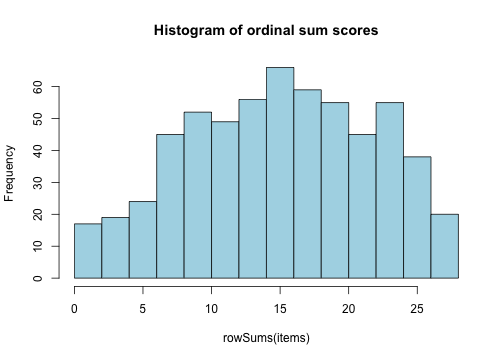
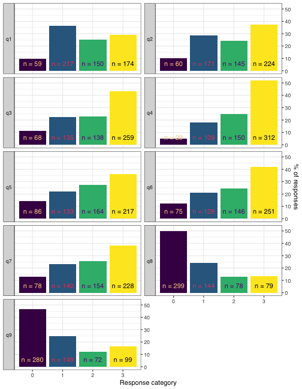
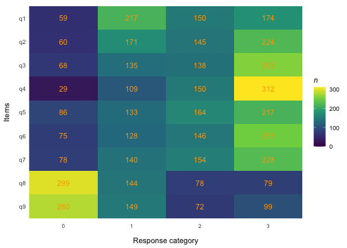
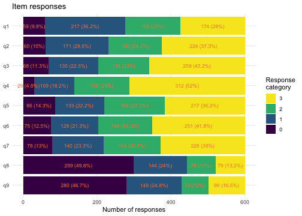
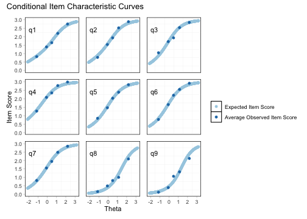
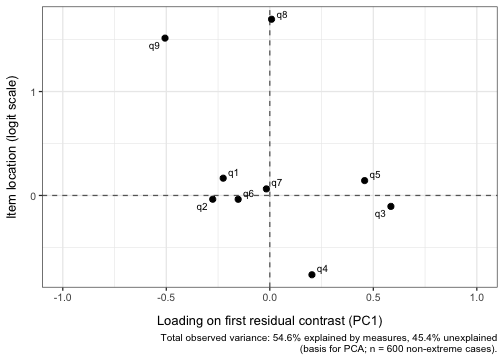
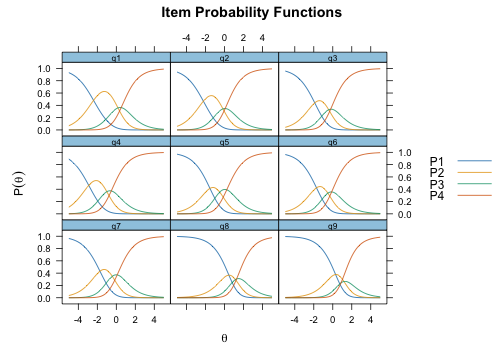
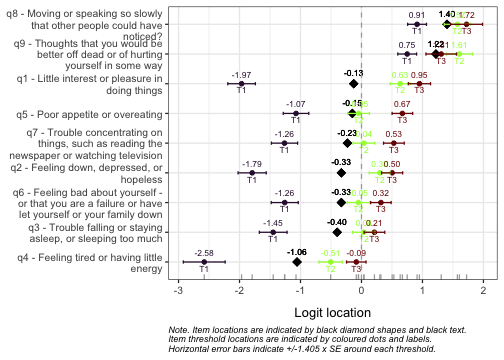
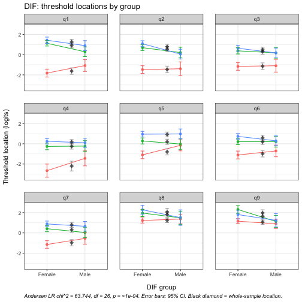
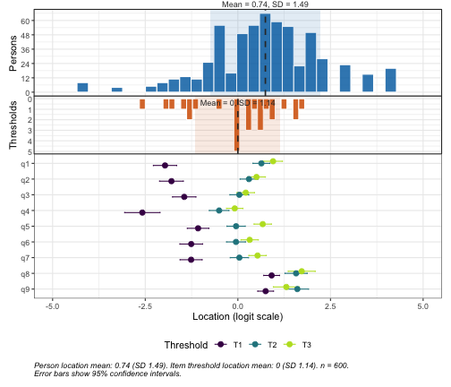

## Overview

This vignette walks through a worked Rasch analysis of the
nine-item Patient Health Questionnaire (PHQ-9; @kroenke_phq9_2001) using
the **easyRasch2** package. The example follows the four psychometric
criteria proposed by @christensen_psychometric_2021 for the validation
of patient-reported outcome measures (PROMs):

1. **Unidimensionality** --- the items measure a single latent
   construct.
2. **Local independence** --- after conditioning on the latent trait,
   item responses are independent of each other.
3. **Ordered response category thresholds** (monotonicity) --- moving
   up the latent trait increases the probability of higher categories.
4. **Invariance / no DIF** --- item parameters are the same across
   relevant external groups (e.g. gender).

We then move on to two complementary descriptors that are commonly
reported alongside the four criteria above:

* **Targeting** --- how well person and item locations overlap on the
  latent continuum.
* **Reliability** --- how precisely the scale separates respondents.

For a more extensive treatment of Rasch analysis in R, including
larger illustrative datasets, see
<https://pgmj.github.io/easyRasch2/>.

## Data

The bundled `phq9` dataset is a 600-respondent random subsample of the
PHQ-9 module from the U.S. National Health and Nutrition Examination
Survey (NHANES, September 2024 release) with complete responses on all
nine items. NHANES microdata are released to the public domain by the
U.S. federal government.


``` r
library(easyRasch2)
library(mirt)
data(phq9)
items <- phq9[, paste0("q", 1:9)]   # 9 item columns, scored 0..3
gender <- phq9$gender               # external grouping variables
age <- phq9$age                     #

# add item information
item_desc <- c(
  "Little interest or pleasure in doing things",
  "Feeling down, depressed, or hopeless",
  "Trouble falling or staying asleep, or sleeping too much",
  "Feeling tired or having little energy", "Poor appetite or overeating",
  "Feeling bad about yourself - or that you are a failure or have let yourself or your family down",
  "Trouble concentrating on things, such as reading the newspaper or watching television",
  "Moving or speaking so slowly that other people could have noticed?",
  "Thoughts that you would be better off dead or of hurting yourself in some way"
)

item_resp <- c("Not at all","Several days","More than \nhalf the days","Nearly every day")
```


``` r
str(items)
#> 'data.frame':	600 obs. of  9 variables:
#>  $ q1: int  3 0 1 2 3 3 1 3 2 1 ...
#>  $ q2: int  3 0 2 3 3 3 1 3 2 0 ...
#>  $ q3: int  3 1 3 0 3 1 0 3 2 0 ...
#>  $ q4: int  3 1 3 2 3 3 1 3 2 0 ...
#>  $ q5: int  3 0 3 2 3 2 0 1 2 0 ...
#>  $ q6: int  3 2 3 2 3 2 2 3 3 0 ...
#>  $ q7: int  3 3 3 2 3 2 2 3 3 0 ...
#>  $ q8: int  1 0 2 0 3 3 0 0 1 0 ...
#>  $ q9: int  3 0 0 2 3 1 2 0 0 0 ...
summary(rowSums(items))
#>    Min. 1st Qu.  Median    Mean 3rd Qu.    Max. 
#>    0.00   10.00   16.00   15.41   21.00   27.00
hist(rowSums(items), col = "lightblue", main = "Histogram of ordinal sum scores")
```

<div class="figure">

<p class="caption">plot of chunk data-overview</p>
</div>

``` r
table(gender, useNA = "ifany")
#> gender
#> Female   Male   <NA> 
#>    426    143     31
summary(age)
#>    Min. 1st Qu.  Median    Mean 3rd Qu.    Max. 
#>   15.00   26.00   33.00   36.06   44.00   85.00
```

### Descriptive plots

Before fitting any model it is worth eyeballing the response
distributions:


``` r
RMbarplot(items, ncol = 2)
```

<div class="figure">

<p class="caption">Faceted bar chart of response distributions</p>
</div>


``` r
RMtileplot(items)
```

<div class="figure">

<p class="caption">Response distribution tile plot</p>
</div>


``` r
RMstackedbarplot(items, show_percent = TRUE)
```

<div class="figure">

<p class="caption">Stacked-bar response distribution</p>
</div>

The plots quickly reveal the PHQ-9's expected floor: most respondents
endorse category 0 ("Not at all") on most items. Category 3 ("Nearly
every day") is rare for several items, foreshadowing thin information
at the upper end of the scale.

## 1. Unidimensionality

`easyRasch2` provides several complementary unidimensionality
diagnostics that can be combined for a robust conclusion:

- item-level conditional infit MSQ statistics [@muller_item_2020]
- item-level item-restscore associations with Goodman-Kruskal's gamma [@kreiner_note_2011]
- confirmatory factor analysis (CFA) with WLSMV estimator for ordinal data
- principal components analysis (PCA) of the standardised residuals [@chou_checking_2010]
- Martin-Löf test with Monte-Carlo p-values [@christensenMonteCarloApproach2007]

### Conditional infit MSQ

Conditional item infit mean-square statistics flag items whose response
patterns deviate from the Rasch expectation. With `RMinfitcutoff()`, per-item
highest-density intervals serve as the reference instead rule-of-thumb cutoffs
[@johansson_detecting_2025].


``` r
infit_cut <- RMinfitcutoff(items, iterations = 200, parallel = FALSE,
                           seed = 3)
RMiteminfit(items, cutoff = infit_cut)
```


Table: MSQ values based on conditional estimation (n = 600 complete cases). Cutoff values based on 200 simulation iterations (99.9% HDCI).

|Item | Infit MSQ| Infit low| Infit high|Flagged | Relative location|
|:----|---------:|---------:|----------:|:-------|-----------------:|
|q1   |     0.946|     0.830|      1.135|FALSE   |             -0.58|
|q2   |     0.778|     0.859|      1.166|TRUE    |             -0.78|
|q3   |     1.234|     0.854|      1.199|TRUE    |             -0.85|
|q4   |     0.835|     0.793|      1.156|FALSE   |             -1.51|
|q5   |     1.069|     0.875|      1.119|FALSE   |             -0.60|
|q6   |     0.895|     0.858|      1.111|FALSE   |             -0.78|
|q7   |     0.986|     0.843|      1.170|FALSE   |             -0.68|
|q8   |     1.260|     0.786|      1.198|TRUE    |              0.95|
|q9   |     1.315|     0.832|      1.174|TRUE    |              0.77|


It is important to note that the `RIitemfit()` function uses **conditional**
infit, which is both robust to different sample sizes and makes ZSTD unnecessary
[@muller_item_2020]. Müller also questions the usefulness of outfit, and my
simulation study [@johansson_detecting_2025] reached the same conclusion. Thus,
outfit is not reported unless requested.

A low item fit value (sometimes referred to as an item "overfitting" the Rasch
model) indicates that responses may be too predictable. This is often the case
for items that are very general/broad in scope in relation to the latent
variable, for instance asking about feeling depressed in a depression
questionnaire. You will often find overfitting items to also have residual
correlations (local dependencies) with other items. Overfit may be likened to
having a much stronger factor loading than other items in a confirmatory factor
analysis or a higher level of discrimination in an Item Response Theory model
with two or more parameters.

A high item fit value (sometimes referred to as "underfitting" the Rasch model)
can indicate several things, often multidimensionality or a question that is
difficult to interpret and thus has noisy response data. The latter could for
instance be caused by a question that asks about two things at the same time or
is ambiguous for other reasons.

Next is a visual presentation of conditional item fit across the latent
continuum, with respondents split into groups based on their latent score.


``` r
RMciccPlot(items, class_intervals = 5)
```

<div class="figure">

<p class="caption">Conditional ICCs with five class intervals</p>
</div>

### Item-restscore

Item-restscore uses Goodman-Kruskal's gamma and shows the expected
and observed correlation between an item and a score based on the rest of the
items [@kreiner_note_2011]. Similarly, but inverted, to item infit, a lower
observed correlation value than expected indicates underfit, that the item may
not belong to the dimension. A higher than expected observed value indicates an
overfitting and possibly redundant item. Overfitting items will often also show
issues with local dependency.

Compared to infit, item-restscore more often flags overfit items (based on
experience), and less often flags underfit items (based on a simulation study
[@johansson_detecting_2025]).


``` r
RMitemrestscore(items)
```


|Item | Observed value| Expected value| Abs. difference| Adj. p-value (BH)|p-value sign. | Location| Rel. location|
|:----|--------------:|--------------:|---------------:|-----------------:|:-------------|--------:|-------------:|
|q1   |           0.66|           0.62|            0.04|             0.210|              |     0.17|         -0.58|
|q2   |           0.72|           0.62|            0.10|             0.000|***           |    -0.04|         -0.78|
|q3   |           0.57|           0.63|            0.06|             0.085|.             |    -0.11|         -0.85|
|q4   |           0.71|           0.62|            0.09|             0.000|***           |    -0.76|         -1.51|
|q5   |           0.62|           0.62|            0.00|             0.968|              |     0.14|         -0.60|
|q6   |           0.69|           0.63|            0.06|             0.021|*             |    -0.04|         -0.78|
|q7   |           0.64|           0.62|            0.02|             0.476|              |     0.06|         -0.68|
|q8   |           0.55|           0.63|            0.08|             0.021|*             |     1.70|          0.95|
|q9   |           0.59|           0.64|            0.05|             0.151|              |     1.51|          0.77|


### CFA-based cutoff for CFI / RMSEA

`RMcfaCutoff()` fits a unidimensional ordinal CFA both to the observed
data and to data simulated from a unidimensional PCM, and returns
parametric-bootstrap cut-offs for model fit indices SRMR, CFI and RMSEA.
Model fit values that exceed the simulated cut-off values are *more extreme
than is plausible under a unidimensional data generating process*.


``` r
cfa_cut <- RMcfaCutoff(items, iterations = 100, parallel = FALSE,
                       seed = 2)
cfa_cut
```


Table: Partial Credit Model posterior-predictive CFA fit-index check. Observed CFA fit (one-factor, lavaan WLSMV, ordered = TRUE) vs simulated null distribution under PCM unidimensionality. n = 600 complete cases, 9 items, 100 parametric-bootstrap iterations. Cutoffs are one-sided at the 99th percentile of the simulated distribution; an item is flagged when the observed value lies in the worst 1% of the null distribution in the unfavourable direction.

|Index | Observed| Cutoff|Direction  |Flagged |
|:-----|--------:|------:|:----------|:-------|
|CFI   |   0.9623| 0.9977|< 1st pct  |TRUE    |
|RMSEA |   0.1217| 0.0377|> 99th pct |TRUE    |
|SRMR  |   0.0572| 0.0230|> 99th pct |TRUE    |


### Residual PCA

After fitting the Rasch model, the residuals should contain no further
systematic structure. The *largest eigenvalue* of the residual correlation
matrix can be considered the headline diagnostic; values clearly above the
simulation-based cut-off suggest a secondary dimension. However, values below
the largest eigenvalue does not by itself support unidimensionality.


``` r
pca_cut <- RMpcaCutoff(items, iterations = 100, parallel = FALSE,
                       seed = 1)
RMresidualPCA(items, cutoff = pca_cut)
```


Table: Partial Credit Model (600 complete cases, 9 items). Total observed variance: 54.6% explained by measures, 45.4% unexplained
(basis for PCA; n = 600 non-extreme cases). First-contrast cutoff = 1.303 based on 100 simulation iterations (99th percentile).

|Component | Eigenvalue| Proportion of variance|Flagged |
|:---------|----------:|----------------------:|:-------|
|PC1       |      1.652|                  0.200|TRUE    |
|PC2       |      1.453|                  0.176|TRUE    |
|PC3       |      1.220|                  0.148|FALSE   |
|PC4       |      0.988|                  0.120|FALSE   |
|PC5       |      0.930|                  0.113|FALSE   |


Also of interest is the plot of item standardised loadings on the first residual
contrast and item locations. This figure can be helpful to identify clusters
in data, perhaps related to local dependency and/or multidimensionality.


``` r
RMresidualPCA(items, output = "loadings")
```

<div class="figure">

<p class="caption">Standardised loadings on the first residual contrast</p>
</div>


## 2. Local independence

Local independence (LD) can be assessed with multiple methods. Yen's $Q_3$
statistic [@yen_scaling_1984] is the correlation between
person-item standardised residuals for every item pair. Pair-wise
$Q_3$ values above the simulation-based cut-off flag LD [@christensen2017].


``` r
q3_cut <- RMlocdepQ3cutoff(items, iterations = 200, parallel = FALSE,
                           seed = 4)
RMlocdepQ3(items, cutoff = q3_cut)
#> Error:
#> ! `cutoff` must be a single numeric value or NULL.
```

A second perspective on LD is the *partial gamma* coefficient
[@kreinerAnalysisLocalDependence2004;@kreiner_validity_2007] between observed
item pairs, conditional on the rest-score:


``` r
RMpartgamLD(items)
```

Table: Partial gamma LD analysis (n = 600 complete cases). Positive gamma indicates positive local dependence between items.

Direction 1: rest score = total - Item2 

 Table: Partial gamma LD analysis (n = 600 complete cases). Positive gamma indicates positive local dependence between items.

Direction 2: rest score = total - Item1 

 |Item 1 |Item 2 | Partial gamma| Adjusted p-value (BH)| 

 |Item 1 |Item 2 | Partial gamma| Adjusted p-value (BH)||:------|:------|-------------:|---------------------:| 

 |:------|:------|-------------:|---------------------:||q1     |q2     |         0.531|                 0.000| 

 |q2     |q1     |         0.577|                 0.000||q1     |q3     |        -0.088|                 1.000| 

 |q3     |q1     |        -0.112|                 1.000||q1     |q4     |         0.150|                 1.000| 

 |q3     |q2     |        -0.136|                 1.000||q1     |q5     |        -0.073|                 1.000| 

 |q4     |q1     |         0.165|                 1.000||q1     |q6     |        -0.136|                 1.000| 

 |q4     |q2     |         0.085|                 1.000||q1     |q7     |        -0.004|                 1.000| 

 |q4     |q3     |         0.361|                 0.000||q1     |q8     |        -0.075|                 1.000| 

 |q5     |q1     |        -0.146|                 1.000||q1     |q9     |         0.008|                 1.000| 

 |q5     |q2     |        -0.265|                 0.015||q2     |q3     |        -0.035|                 1.000| 

 |q5     |q3     |         0.303|                 0.000||q2     |q4     |         0.074|                 1.000| 

 |q5     |q4     |         0.194|                 0.684||q2     |q5     |        -0.195|                 0.818| 

 |q6     |q1     |        -0.132|                 1.000||q2     |q6     |         0.258|                 0.018| 

 |q6     |q2     |         0.205|                 0.394||q2     |q7     |        -0.078|                 1.000| 

 |q6     |q3     |        -0.030|                 1.000||q2     |q8     |        -0.323|                 0.001| 

 |q6     |q4     |        -0.053|                 1.000||q2     |q9     |         0.332|                 0.001| 

 |q6     |q5     |         0.046|                 1.000||q3     |q4     |         0.270|                 0.011| 

 |q7     |q1     |        -0.072|                 1.000||q3     |q5     |         0.269|                 0.005| 

 |q7     |q2     |        -0.168|                 1.000||q3     |q6     |        -0.135|                 1.000| 

 |q7     |q3     |        -0.169|                 1.000||q3     |q7     |        -0.178|                 0.667| 

 |q7     |q4     |         0.024|                 1.000||q3     |q8     |        -0.100|                 1.000| 

 |q7     |q5     |        -0.008|                 1.000||q3     |q9     |        -0.197|                 0.446| 

 |q7     |q6     |         0.094|                 1.000||q4     |q5     |         0.232|                 0.102| 

 |q8     |q1     |        -0.168|                 1.000||q4     |q6     |        -0.074|                 1.000| 

 |q8     |q2     |        -0.415|                 0.000||q4     |q7     |         0.062|                 1.000| 

 |q8     |q3     |        -0.101|                 1.000||q4     |q8     |        -0.081|                 1.000| 

 |q8     |q4     |        -0.221|                 0.544||q4     |q9     |        -0.381|                 0.000| 

 |q8     |q5     |         0.026|                 1.000||q5     |q6     |        -0.021|                 1.000| 

 |q8     |q6     |        -0.089|                 1.000||q5     |q7     |         0.022|                 1.000| 

 |q8     |q7     |         0.243|                 0.025||q5     |q8     |         0.083|                 1.000| 

 |q9     |q1     |        -0.012|                 1.000||q5     |q9     |        -0.131|                 1.000| 

 |q9     |q2     |         0.291|                 0.007||q6     |q7     |         0.137|                 1.000| 

 |q9     |q3     |        -0.159|                 1.000||q6     |q8     |        -0.020|                 1.000| 

 |q9     |q4     |        -0.453|                 0.000||q6     |q9     |         0.287|                 0.009| 

 |q9     |q5     |        -0.207|                 0.257||q7     |q8     |         0.303|                 0.001| 

 |q9     |q6     |         0.200|                 0.585||q7     |q9     |        -0.043|                 1.000| 

 |q9     |q7     |        -0.149|                 1.000||q8     |q9     |         0.036|                 1.000| 

 |q9     |q8     |         0.059|                 1.000|

The two approaches agree where they overlap; pairs flagged by both are
the strongest candidates for further inspection or possible item
revision or deletion.

## 3. Ordered response category thresholds

For a polytomous item to be measuring as intended, the thresholds
separating adjacent response categories should be ordered: the
threshold from "Not at all" to "Several days" should sit below the one
from "Several days" to "More than half the days", and so on.

A classical method to assess item response functions is to plot probability of
response curves for each item and response category. The `mirt` package has a
simple way to achieve this.


``` r
mirt(items, model=1, itemtype='Rasch', verbose = FALSE) |>
  plot(type="trace", as.table = TRUE,
       theta_lim = c(-5,5)) # changes x axis limits
```

<div class="figure">

<p class="caption">plot of chunk mirt_ipf</p>
</div>

`RMitemHierarchy()` plots each item's threshold locations on the
latent scale, ordered by overall item difficulty. Disordered
thresholds appear as overlapping or reversed segments and are a clear
signal that the response categories are not being used in the intended
order.


``` r
RMitemHierarchy(items, item_labels = item_desc)
```

<div class="figure">

<p class="caption">Item-hierarchy</p>
</div>

## 4. Invariance / no DIF

We use two complementary DIF assessments. The Andersen likelihood-ratio
test [LRT, @andersen_goodness_1973] partitions the sample by an external
variable, refits the model in each subgroup, and compares item
locations. The partial gamma approach
[@kreiner_validity_2007;@christensen_psychometric_2021] looks for an
association between item responses and the external variable
*conditional on the rest-score*. Both are run on the *gender* variable
here (after dropping respondents with missing gender):


``` r
keep    <- !is.na(gender)
items_g <- items[keep, ]
gender_g <- droplevels(gender[keep])
```

### Andersen LR-test (eRm)


``` r
RMdifLR(items_g, dif_var = gender_g, level = "threshold")
```

<div class="figure">

<p class="caption">Andersen LR-test DIF locations by gender</p>
</div>

The plot shows the item threshold locations estimated in each gender group with
the corresponding confidence band.

### Partial-gamma DIF


``` r
RMpartgamDIF(items_g, dif_var = gender_g)
```


Table: Partial gamma DIF analysis (n = 569 complete cases). Positive gamma indicates higher scores in higher DIF group levels.

|Item | Partial gamma|    SE| Lower CI| Upper CI| Adjusted p-value (BH)|
|:----|-------------:|-----:|--------:|--------:|---------------------:|
|q1   |         0.251| 0.104|    0.046|    0.456|                 0.148|
|q2   |         0.411| 0.094|    0.227|    0.595|                 0.000|
|q3   |         0.064| 0.103|   -0.138|    0.266|                 1.000|
|q4   |        -0.092| 0.114|   -0.315|    0.131|                 1.000|
|q5   |        -0.286| 0.092|   -0.467|   -0.104|                 0.018|
|q6   |        -0.155| 0.105|   -0.361|    0.050|                 1.000|
|q7   |        -0.075| 0.102|   -0.275|    0.126|                 1.000|
|q8   |        -0.112| 0.102|   -0.311|    0.088|                 1.000|
|q9   |         0.180| 0.100|   -0.015|    0.376|                 0.638|


For a model-based DIF analysis that can handle *continuous*
covariates and interactions (e.g. age × gender), see
`?RMdifTree` [@strobl_rasch_2015;@henninger_partial_2025].

## Targeting

A targeting plot summarises how well the item-threshold distribution matches
the distribution of person locations on the latent scale --- a Wright-map style
display.


``` r
RMtargeting(items)
```

<div class="figure">

<p class="caption">Person-item targeting</p>
</div>

## Reliability

`RMreliability()` reports four reliability metrics: person separation
reliability (PSI); Relative Measurement Uncertainty (RMU)
estimate derived from posterior person-location uncertainty using plausible values; Cronbach's alpha; and Empirical reliability (using `mirt::empirical_rxx()`. PSI, alpha and empirical can use bootstrap for confidence intervals. All reliability metrics range from 0 to 1, with higher values indicating better separation/precision.


``` r
RMreliability(items, draws = 200, rmu_iter = 20, parallel = FALSE,
              seed = 5)
```


Table: Reliability for 9 items, n = 600. PSI excludes min/max scoring respondents.

|Metric           | Estimate| Lower (95% HDCI)| Upper (95% HDCI)|Notes                      |
|:----------------|--------:|----------------:|----------------:|:--------------------------|
|Cronbach's alpha |    0.886|               NA|               NA|no bootstrap               |
|PSI              |    0.847|               NA|               NA|no bootstrap               |
|Empirical (WLE)  |    0.872|               NA|               NA|no bootstrap               |
|RMU (WLE)        |    0.882|            0.867|            0.897|200 PVs, 20 RMU iterations |


For converting ordinal sum-scores to interval-scaled person-location
estimates with associated standard errors, use `RMscoreSE()`:


``` r
RMscoreSE(items, output = "figure")
#> Error in `match.arg()`:
#> ! 'arg' should be one of "kable", "dataframe", "ggplot"
RMscoreSE(items)
```


Table: Person locations via Warm's WLE (CML item parameters from eRm).

| Ordinal sum score| Logit score| Logit std.error|
|-----------------:|-----------:|---------------:|
|                 0|      -4.469|           0.682|
|                 1|      -3.234|           0.815|
|                 2|      -2.594|           0.748|
|                 3|      -2.138|           0.661|
|                 4|      -1.779|           0.592|
|                 5|      -1.480|           0.540|
|                 6|      -1.224|           0.502|
|                 7|      -1.000|           0.473|
|                 8|      -0.798|           0.450|
|                 9|      -0.613|           0.433|
|                10|      -0.440|           0.420|
|                11|      -0.277|           0.410|
|                12|      -0.119|           0.403|
|                13|       0.034|           0.398|
|                14|       0.186|           0.396|
|                15|       0.338|           0.396|
|                16|       0.491|           0.398|
|                17|       0.647|           0.402|
|                18|       0.806|           0.408|
|                19|       0.970|           0.417|
|                20|       1.141|           0.431|
|                21|       1.320|           0.450|
|                22|       1.512|           0.478|
|                23|       1.723|           0.516|
|                24|       1.968|           0.565|
|                25|       2.276|           0.620|
|                26|       2.724|           0.659|
|                27|       3.700|           0.567|


## Where to next

* Each `RM*()` function is documented with its own `?function`
  reference page including a worked example.
* The simulation-based cut-offs used above (`RM*cutoff()`) can be
  parallelised via the `mirai` package; see the relevant help pages.
* For DIF with continuous covariates or interactions, see
  `?RMdifTree`.
* For multiple-imputation workflows on item-fit cut-offs, see
  `?RMinfitcutoff_mi`.

## References
